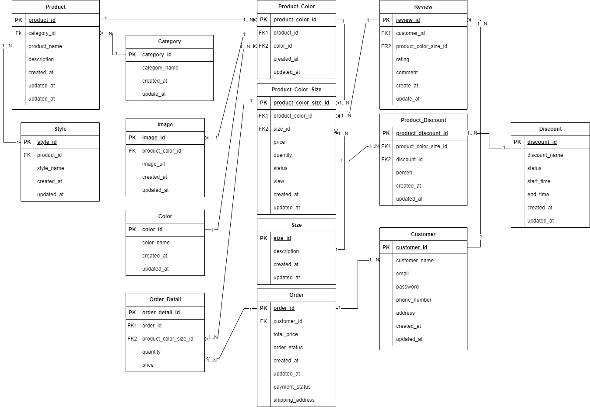

# GIỚI THIỆU

**FashionShop** là một dự án quản lý hệ thống bán hàng thời trang trực tuyến, tập trung vào việc quản lý các đối tượng như Category, Customer, Style, Product, Color, Product_Color, Image, Size, Product_Color_Size, Discount, Product_Discount, Review, Order, và OrderDetail.

Mỗi đối tượng trong hệ thống có các chức năng riêng biệt, cho phép quản lý chi tiết thông tin sản phẩm, màu sắc, kích cỡ, khuyến mãi, và đơn hàng. Bên cạnh đó, các chức năng chung và cơ bản như thêm, sửa, xóa, và cập nhật đều được tích hợp nhằm đảm bảo hệ thống có thể vận hành linh hoạt và dễ dàng tùy chỉnh. FashionShop hướng tới mục tiêu xây dựng một nền tảng quản lý thời trang toàn diện, đáp ứng nhu cầu của cả người bán và người mua.

Hệ thống này cũng cung cấp cho người quản trị viên khả năng dễ dàng tính tổng doanh thu theo tuần, quý, tháng và năm. Người quản trị viên có thể lựa chọn khoảng thời gian cụ thể để tính toán doanh thu, giúp họ theo dõi hiệu quả kinh doanh và đưa ra các quyết định chiến lược kịp thời. Tính năng này không chỉ giúp nâng cao khả năng phân tích dữ liệu mà còn hỗ trợ trong việc lập kế hoạch và dự báo doanh thu trong tương lai, từ đó tối ưu hóa hoạt động kinh doanh và nâng cao trải nghiệm khách hàng.

# PHÂN TÍCH THIẾT KẾ HỆ THỐNG



Chi tiết hơn xem tại: [ERD của FashionShop](https://app.diagrams.net/#G1rt4fzEt1R4pe3caYk0sWde3HXYiygynk#%7B%22pageId%22%3A%22R2lEEEUBdFMjLlhIrx00%22%7D)

# API DỰ ÁN

BASE URL của dự án: https://fashionshopapi-fashion.up.railway.app/

# Chức năng

## 1. Category
### 1.1 Thêm category

```bash
curl --location 'https://fashionshopapi-fashion.up.railway.app/api/categories' \
--header 'Content-Type: application/json' \
--data '{
    "categoryName" : "Home & Decor"
}'
```

### 1.2 Lấy tất cả category
```bash
curl --location 'https://fashionshopapi-fashion.up.railway.app/api/categories'
```

### 1.3 Tìm kiếm category theo tên của category
```bash
curl --location 'https://fashionshopapi-fashion.up.railway.app/api/categories/search?categoryName=categoryName'
```

### 1.4 Lấy category theo ID
```bash
curl --location 'https://fashionshopapi-fashion.up.railway.app/api/categories/15aedbd9-17c3-4861-977c-5d013294c547'
```

### 1.5 Cập nhập category
```bash
curl --location --request PUT 'https://fashionshopapi-fashion.up.railway.app/api/categories' \
--header 'Content-Type: application/json' \
--data '{
    "categoryId" : "15aedbd9-17c3-4861-977c-5d013294c547",
    "categoryName" : "your_category_name"
}'
```

### 1.6 Xoá category
```bash
curl --location --request DELETE 'https://fashionshopapi-fashion.up.railway.app/api/categories/15aedbd9-17c3-4861-977c-5d013294c547'
```

## 2. Style
### 2.1 Thêm style sản phẩm
```bash
curl --location 'https://fashionshopapi-fashion.up.railway.app/api/styles' \
--header 'Content-Type: application/json' \
--data '{
    "styleName" : "Patchwork"
}'
```

### 2.2 Lấy ra tất cả style
```bash
curl --location 'https://fashionshopapi-fashion.up.railway.app/api/styles'
```

### 2.3 Lấy style theo ID
```bash
curl --location 'https://fashionshopapi-fashion.up.railway.app/api/styles/2459c142-6b15-46e0-af69-0c34622f3d3e'
```

### 2.4 Lấy style theo tên style
```bash
curl --location 'https://fashionshopapi-fashion.up.railway.app/api/styles/search?styleName=style_name'
```

### 2.5 Xoá style
```bash
curl --location --request DELETE 'https://fashionshopapi-fashion.up.railway.app/api/styles/2459c142-6b15-46e0-af69-0c34622f3d3e'
```

### 2.6 Cập nhật style
```bash
curl --location --request PUT 'https://fashionshopapi-fashion.up.railway.app/api/styles' \
--header 'Content-Type: application/json' \
--data '{
    "styleId" : "2459c142-6b15-46e0-af69-0c34622f3d3e",
    "styleName" : "your_style_name"
}'
```

## 3. Color
### 3.1 Thêm color
```bash
curl --location 'https://fashionshopapi-fashion.up.railway.app/api/colors' \
--header 'Content-Type: application/json' \
--data '{
    "colorName" : "#FFFFFF"
}'
```

### 3.2 Lấy tất cả color
```bash
curl --location 'https://fashionshopapi-fashion.up.railway.app/api/colors'
```

### 3.3 Tìm kiếm color theo tên
```bash
curl --location 'https://fashionshopapi-fashion.up.railway.app/api/colors/search?colorName=#F'
```

### 3.4 Lấy color theo ID
```bash
curl --location 'https://fashionshopapi-fashion.up.railway.app/api/colors/42f84d14-cac6-467d-950e-0591578765ad'
```

### 3.5 Cập nhập color
```bash
curl --location --request PUT 'https://fashionshopapi-fashion.up.railway.app/api/colors' \
--header 'Content-Type: application/json' \
--data '{
    "colorId" : "42f84d14-cac6-467d-950e-0591578765ad",
    "colorName" : "new_color_name"
}'
```

### 3.6 Xoá Color
```bash
curl --location --request DELETE 'https://fashionshopapi-fashion.up.railway.app/api/colors/bf251a16-b62c-4010-8a99-38cb866e11c8'
```

## 4. Customer
### 4.1 Thêm tài khoản
Mô tả: Mật khẩu phải ít nhất 8 ký tự, có chữ viết hoa, viết thường, ký tự đặc biệt, số.
```bash
curl --location 'https://fashionshopapi-fashion.up.railway.app/api/customers' \
--header 'Content-Type: application/json' \
--data-raw '{
    "customerName" : "Nguyễn Thị Hiền",
    "phoneNumber" : "0123456789",
    "email" : "nthien.20it5@vku.udn.vn",
    "password" : "Hien@2001",
    "address" : "Đà Nẵng"
}'
```
### 4.2 Lấy ra tất cả người dùng
```bash
curl --location 'https://fashionshopapi-fashion.up.railway.app/api/customers'
```

### 4.3 Lấy tài khoản theo ID
```bash
curl --location 'https://fashionshopapi-fashion.up.railway.app/api/customers/4c109d4d-ebb9-4580-9341-1dde500b805c'
```

### 4.4 Lấy tài khoản theo email
```bash
curl --location 'https://fashionshopapi-fashion.up.railway.app/api/customers?email=nthien%40gmail.com'
```

### 4.5 Cập nhập tài khoản
```bash
curl --location --request PUT 'https://fashionshopapi-fashion.up.railway.app/api/customers' \
--header 'Content-Type: application/json' \
--data-raw '{
    "customerId" : "1f987149-acdd-4556-ac07-3234d1eec99b",
    "customerName" : "your_customer_name",
    "phoneNumber" : "your_number",
    "email" : "your_email",
    "password" : "your_password",
    "address" : "your_address"
}'
```

### 4.6 Xoá tài khoản
```bash
curl --location --request DELETE 'https://fashionshopapi-fashion.up.railway.app/api/customers/c8785a95-c5ea-45ef-81fd-50b7445eba6f'
```

## 5. Discount
### 5.1 Thêm chương trình giảm giá
```bash
curl --location 'https://fashionshopapi-fashion.up.railway.app/api/discounts' \
--header 'Content-Type: application/json' \
--data '{
    "discountName": "Vietnamese Women'\''s Day",
    "startTime": "2024-10-10T00:00:00",
    "endTime": "2024-10-20T23:59:59"
}
'
```

### 5.2 Lấy ra tất cả chương trình giảm giá
```bash
curl --location 'https://fashionshopapi-fashion.up.railway.app/api/discounts'
```

### 5.3 Lấy chương trình giảm giá theo ID
```bash
curl --location 'https://fashionshopapi-fashion.up.railway.app/api/discounts/09279327-ea7d-4e7f-bad7-def5828780d2'
```

### 5.4 Tìm kiếm chương trình giảm giá theo trạng thái
Gồm có các trạng thái như: ACTIVE, UPCOMING, EXPIRED
```bash
curl --location 'https://fashionshopapi-fashion.up.railway.app/api/discounts/status/ACTIVE'
```

### 5.5 Lấy chương trình giảm giá theo tên
```bash
curl --location 'https://fashionshopapi-fashion.up.railway.app/api/discounts/search/International'
```

### 5.6 Cập nhật chương trình giảm giá
```bash
curl --location --request PUT 'https://fashionshopapi-fashion.up.railway.app/api/discounts' \
--header 'Content-Type: application/json' \
--data ' {
    "discountId": "b83d27cb-edda-4d33-ad4e-2d5999b2d98d",
    "discountName": "Valentine’s Day",
    "startTime": "2024-02-07T00:00:00",
    "endTime": "2024-02-14T23:59:59"
}'
```

### 5.7 Xoá chương trình giảm giá
```bash
curl --location --request DELETE 'https://fashionshopapi-fashion.up.railway.app/api/discounts/aabf12d5-7757-4eaf-bd40-d5a8e59c71bb'
```

### 6. Size
### 6.1 Thêm size
```bash
curl --location 'https://fashionshopapi-fashion.up.railway.app/api/sizes' \
--header 'Content-Type: application/json' \
--data '{
    "sizeId": "S",
    "description": "45 - 52kg"
}'
```

### 6.2 Lấy ra tất cả size
```bash
curl --location 'https://fashionshopapi-fashion.up.railway.app/api/sizes'
```

### 6.3 Lấy size theo ID
```bash
curl --location 'https://fashionshopapi-fashion.up.railway.app/api/sizes/XL'
```

### 6.4 Cập nhật size
```bash
curl --location --request PUT 'https://fashionshopapi-fashion.up.railway.app/api/sizes' \
--header 'Content-Type: application/json' \
--data '{
    "sizeId" : "XXXL",
    "description" :  "80 - 95kg"
}'
```

### 6.5 Xoá size
```bash
curl --location --request DELETE 'https://fashionshopapi-fashion.up.railway.app/api/sizes/XXXL'
```

### 7. Product
### 7.1 Thêm sản phẩm
```bash
curl --location 'https://fashionshopapi-fashion.up.railway.app/api/products' \
--header 'Content-Type: application/json' \
--data '{
    "productName" : "Short Dress",
    "description" : "Material: Wool",
    "category" : 
        {
            "categoryId" : "1cf7643b-483b-41ff-a455-5b4500785974"
        },
    "style" : 
        {
            "styleId" : "f977b23b-abc6-4744-83f1-c595cdd19d51"
        }
}'
```

### 7.2 Lấy ra tất cả sản phẩm
```bash
curl --location 'https://fashionshopapi-fashion.up.railway.app/api/products'
```

### 7.3 Lấy sản phẩm theo ID
```bash
curl --location --request GET 'https://fashionshopapi-fashion.up.railway.app/api/products/c21e76ee-3901-42e9-8ebf-cd23eda376ba' \
--header 'Content-Type: application/json' \
--data '{
    "productId" : "your_product_id",
    "productName" : "your_product_name",
    "description" : "your_description",
    "category" : 
        {
            "categoryId" : "your_category_id"
        },
    "style" : 
        {
            "styleId" : "your_style_id"
        }
}'
```

### 7.4 Lấy sản phẩm theo tên
```bash
curl --location 'https://fashionshopapi-fashion.up.railway.app/api/products/search?productName=Dress'
```

### 7.5 Cập nhật sản phẩm
```bash
curl --location --request PUT 'https://fashionshopapi-fashion.up.railway.app/api/products' \
--header 'Content-Type: application/json' \
--data '{
    "productId" : "your_product_id",
    "productName" : "your_product_name",
    "description" : "your_description",
    "category" : 
        {
            "categoryId" : "your_category_id"
        },
    "style" : 
        {
            "styleId" : "your_style_id"
        }
}'
```

### 7.6 Xoá sản phẩm
```bash
curl --location --request DELETE 'https://fashionshopapi-fashion.up.railway.app/api/products/ef6a8c7c-779b-4656-98f2-edca416d5f80'
```

### 8. Product_Color
### 8.1 Thêm Sản phẩm - Màu
```bash
curl --location 'https://fashionshopapi-fashion.up.railway.app/api/product-colors' \
--header 'Content-Type: application/json' \
--data '{
    "product": {
        "productId": "c21e76ee-3901-42e9-8ebf-cd23eda376ba"
    },
    "color": {
        "colorId": "f6b21752-0555-4d53-bbf2-53fa1b0e161a"
    }
}
'
```

### 8.2 Lấy ra tất cả Sản phẩm - Màu
```bash
curl --location 'https://fashionshopapi-fashion.up.railway.app/api/product-colors'
```

### 8.3 Lấy ra Sản phẩm - Màu theo ID
```bash
curl --location 'https://fashionshopapi-fashion.up.railway.app/api/product-colors/2b34c320-9b36-4bc0-b73c-e4ba6684fffe'
```

### 8.4 Cập nhật Sản phẩm - Màu
```bash
curl --location --request PUT 'https://fashionshopapi-fashion.up.railway.app/api/product-colors/3b6f0225-caf3-4091-9d80-0bf170e8f63e' \
--header 'Content-Type: application/json' \
--data '{
    "color": {
        "colorId": "your_color_id"
    },
    "product": {
        "productId": "your_product_id"
    },
    "imageList" : [
        {
         "imageId" : "your_image_id",
         "imageUrl" : "your_image_url"
        }
    ],
    "productColorSize" : [
        {
            "productColorSizeId" : "your_product_color_size_id"
        }
    ]
}'
```

### 8.5 Xoá Sản phẩm - Màu
```bash
curl --location --request DELETE 'https://fashionshopapi-fashion.up.railway.app/api/products/c21e76ee-3901-42e9-8ebf-cd23eda376ba'
```

### 9. Image
### 9.1 Thêm hình ảnh
```bash
curl --location 'https://fashionshopapi-fashion.up.railway.app/api/images/upload' \
--form 'productColorId="f0c618a0-f70e-4fe8-8b44-5a5a333c9027"' \
--form 'files=@"/C:/Users/nthie/OneDrive/Pictures/Screenshots/Short Dress 1.1.png"' \
--form 'files=@"/C:/Users/nthie/OneDrive/Pictures/Screenshots/Short Dress 1.2.png"'
```

### 10. Product_Color_Size
### 10.1 Thêm Sản phẩm - Màu - Kích cỡ
```bash
curl --location 'https://fashionshopapi-fashion.up.railway.app/api/product-color-sizes' \
--header 'Content-Type: application/json' \
--data '{
    "productColor": {
        "productColorId": "2b34c320-9b36-4bc0-b73c-e4ba6684fffe"
    },
    "size": {
        "sizeId": "S"
    },
    "price": 30,
    "quantity": 30,
    "productStatus": 0,
    "numView": 0
}'
```

### 10.2 Lấy ra tất cả Sản phẩm - Màu - Kích cỡ
```bash
curl --location 'https://fashionshopapi-fashion.up.railway.app/api/product-color-sizes'
```

### 10.3 Lấy Sản phẩm - Màu - Kích cỡ theo ID
```bash
curl --location 'https://fashionshopapi-fashion.up.railway.app/api/product-color-sizes/0442c61d-7562-403d-aed6-a36ff87ff6f8'
```

### 10.4 Lọc Sản phẩm - Màu - Kích cỡ theo nhiều trường
```bash
curl --location --request GET 'https://fashionshopapi-fashion.up.railway.app/api/product-color-sizes/filter' \
--header 'Content-Type: application/json' \
--data '{
    "categoriesId": null,
    "stylesId": null,
    "colorsId": null,
    "sizeId": null,
    "startPrice": 0,
    "endPrice": 50
}'
```

### 10.5 Cập nhật Sản phẩm - Màu - Kích cỡ
```bash
curl --location --request PUT 'https://fashionshopapi-fashion.up.railway.app/api/product-color-sizes/8ce58a27-b56c-47d3-8a0c-1e98d7f50bf2' \
--header 'Content-Type: application/json' \
--data '{
    "productColor": {
        "productColorId": "your_product_color_id"
    },
    "size": {
        "sizeId": "your_size_id"
    },
    "price": 0,
    "quantity": 10,
    "productStatus": 0,
    "numView": 0
}'
```

### 10.6 Xoá Sản phẩm - Màu - Kích cỡ
```bash
curl --location --request DELETE 'https://fashionshopapi-fashion.up.railway.app/api/product-color-sizes/0442c61d-7562-403d-aed6-a36ff87ff6f8'
```

### 11. Product_Discount
### 11.1 Thêm Chương trình giảm giá cho sản phẩm
```bash
curl --location 'https://fashionshopapi-fashion.up.railway.app/api/product-discounts' \
--header 'Content-Type: application/json' \
--data '{
    "percent" : 20,
    "discount" : {
        "discountId" :  "09279327-ea7d-4e7f-bad7-def5828780d2"
    },
    "productColorSize" : {
        "productColorSizeId" : "0442c61d-7562-403d-aed6-a36ff87ff6f8"
    }
}'
```

### 11.2 Lấy ra tất cả Chương trình giảm giá cho sản phẩm
```bash
curl --location 'https://fashionshopapi-fashion.up.railway.app/api/product-discounts'
```

### 11.3 Lấy Chương trình giảm giá cho sản phẩm theo ID
```bash
curl --location 'https://fashionshopapi-fashion.up.railway.app/api/product-discounts/258b6fc3-b20d-497d-9b5c-bf01f59b7485'
```

### 11.4 Cập nhật chương trình giảm giá
```bash
curl --location --request PUT 'https://fashionshopapi-fashion.up.railway.app/api/product-discounts/eafadbe2-3ed8-434a-8728-1e79f7ecb145' \
--header 'Content-Type: application/json' \
--data '{
    "percent" : 20,
    "discount" : {
        "discountId" :  "your_discount_id"
    },
    "productColorSize" : {
        "productColorSizeId" : "your_product_color_size_id"
    }
}'
```

### 11.5 Xoá Chương trình giảm giá cho sản phẩm
```bash
curl --location --request DELETE 'https://fashionshopapi-fashion.up.railway.app/api/product-discounts/43a3199e-b408-4ec7-ac18-bca886fd661c'
```

### 12. Review
### 12.1 Thêm đánh giá cho Product_Color_Size
```bash
curl --location 'https://fashionshopapi-fashion.up.railway.app/api/reviews' \
--header 'Content-Type: application/json' \
--data '{
    "rating": 5,
    "comment": "Good",
    "customer": {
        "customerId": "1f987149-acdd-4556-ac07-3234d1eec99b"
    },
    "productColorSize" : {
        "productColorSizeId" : "0442c61d-7562-403d-aed6-a36ff87ff6f8"
    }
}'
```

### 12.2 Lấy ra tất cả đánh giá
```bash
curl --location 'https://fashionshopapi-fashion.up.railway.app/api/reviews'
```

### 12.3 Lấy đánh giá theo ID
```bash
curl --location 'https://fashionshopapi-fashion.up.railway.app/api/reviews/1ac157f3-3c55-4d11-a3d0-bba258b3505a'
```

### 12.4 Lấy đánh giá theo khách hàng
```bash
curl --location 'https://fashionshopapi-fashion.up.railway.app/api/reviews/customer/4c109d4d-ebb9-4580-9341-1dde500b805c'
```

### 12.5 Cập nhật đánh giá
```bash
curl --location --request PUT 'https://fashionshopapi-fashion.up.railway.app/api/reviews' \
--header 'Content-Type: application/json' \
--data '{
    "reviewId" : "21da3211-6fb8-42de-9fae-52c7508394d4",
    "rating" : 2,
    "comment" : "your_comment",
    "customer" : {
        "customerId" : "your_customer_id"
    }
}'
```

### 12.6 Xoá đánh giá
```bash
curl --location --request DELETE 'https://fashionshopapi-fashion.up.railway.app/api/reviews/21da3211-6fb8-42de-9fae-52c7508394d4'
```

### 13. Order
### 13.1 Thêm đơn hàng
```bash
curl --location 'https://fashionshopapi-fashion.up.railway.app/api/orders' \
--header 'Content-Type: application/json' \
--data '{
    "totalPrice": 65,
    "orderStatus": 0,
    "paymentMethod": "store",
    "shippingAddress": "Đà Nẵng",
    "orderDetails": [
        {
            "quantity": 1,
            "price": 30,
            "productColorSize": {
                "productColorSizeId": "0442c61d-7562-403d-aed6-a36ff87ff6f8"
            }
        },
        {
            "quantity": 1,
            "price": 35,
            "productColorSize": {
                "productColorSizeId": "32aac7c8-36fe-4841-8cc0-2319a08ebe97"
            }
        }
    ],
    "customer": {
        "customerId": "1f987149-acdd-4556-ac07-3234d1eec99b"
    }
}'
```

### 13.2 Lấy ra tất cả đơn hàng
```bash
curl --location 'https://fashionshopapi-fashion.up.railway.app/api/orders'
```

### 13.3 Lấy đơn hàng theo ID
```bash
curl --location 'https://fashionshopapi-fashion.up.railway.app/api/orders/d66c2a8f-451a-4ebe-bcb9-abd8a64a8c34'
```

### 13.4 Xác nhận đơn hàng
```bash
curl --location --request POST 'https://fashionshopapi-fashion.up.railway.app/api/orders/confirm?orderId=90b6cb0e-3cf7-4c6d-bcf6-e074e84aa7f9'
```

### 13.5 Huỷ đơn hàng
```bash
curl --location --request POST 'https://fashionshopapi-fashion.up.railway.app/api/orders/cancel?orderId=0336a317-f328-40e4-bba2-d302277b7617'
```

### 13.6 Cập nhật trạng thái đơn hàng
Chỉ update cho delivered return với shipper
```bash
curl --location --request PUT 'https://fashionshopapi-fashion.up.railway.app/api/orders/d66c2a8f-451a-4ebe-bcb9-abd8a64a8c34/order-status?status=DELIVERED'
```

### 13.7 Cập nhật đơn hàng
```bash
curl --location --request PUT 'https://fashionshopapi-fashion.up.railway.app/api/orders/' \
--header 'Content-Type: application/json' \
--data '{
    "totalPrice": 1000,
    "orderStatus": 0,
    "paymentMethod": "your_payment_method",
    "shippingAddress": "your_shipping_address",
    "orderDetails": [
        {
            "quantity": 1,
            "price": 100000,
            "productColorSize": {
                "productColorSizeId": "your_product_color_size_id"
            }
        },
        {
            "quantity": 2,
            "price": 100000,
            "productColorSize": {
                "productColorSizeId": "your_product_color_size_id"
            }
        }
    ]
}'
```

### 13.8 Lấy tổng doanh thu theo thời gian
```bash
curl --location 'https://fashionshopapi-fashion.up.railway.app/api/orders/revenue?periodType=WEEK&quantity=2'
```

### 13.9 Xoá đơn hàng
```bash
curl --location --request DELETE 'https://fashionshopapi-fashion.up.railway.app/api/orders/0336a317-f328-40e4-bba2-d302277b7617'
```

### 14. OrderDetail
### 14.1 Lấy ra tất cả đơn hàng chi tiết
```bash
curl --location 'https://fashionshopapi-fashion.up.railway.app/api/order-details'
```

### 14.2 Lấy đơn hàng chi tiết theo ID
```bash
curl --location 'https://fashionshopapi-fashion.up.railway.app/api/order-details/3f342085-5b24-416c-999d-fde731ece18c'
```
